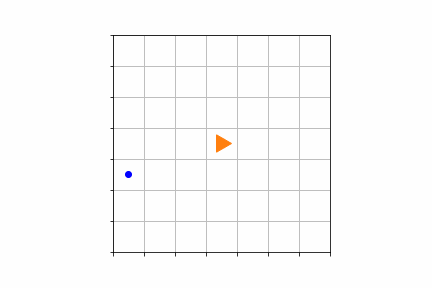

# Snake-AI
A reinforcement learning deep Q-learning based AI that self learns to play the classic game Snake.

### Example run
Here is an example run of the AI playing snake.

### Performance
Out of 100 random runs with the current neural network weights, 9 runs achieved perfect play (the snake filled the entire playing area). In 46 runs the AI achieved perfect or near perfect play (i.e. snake filled at least 90% of the playing area).
